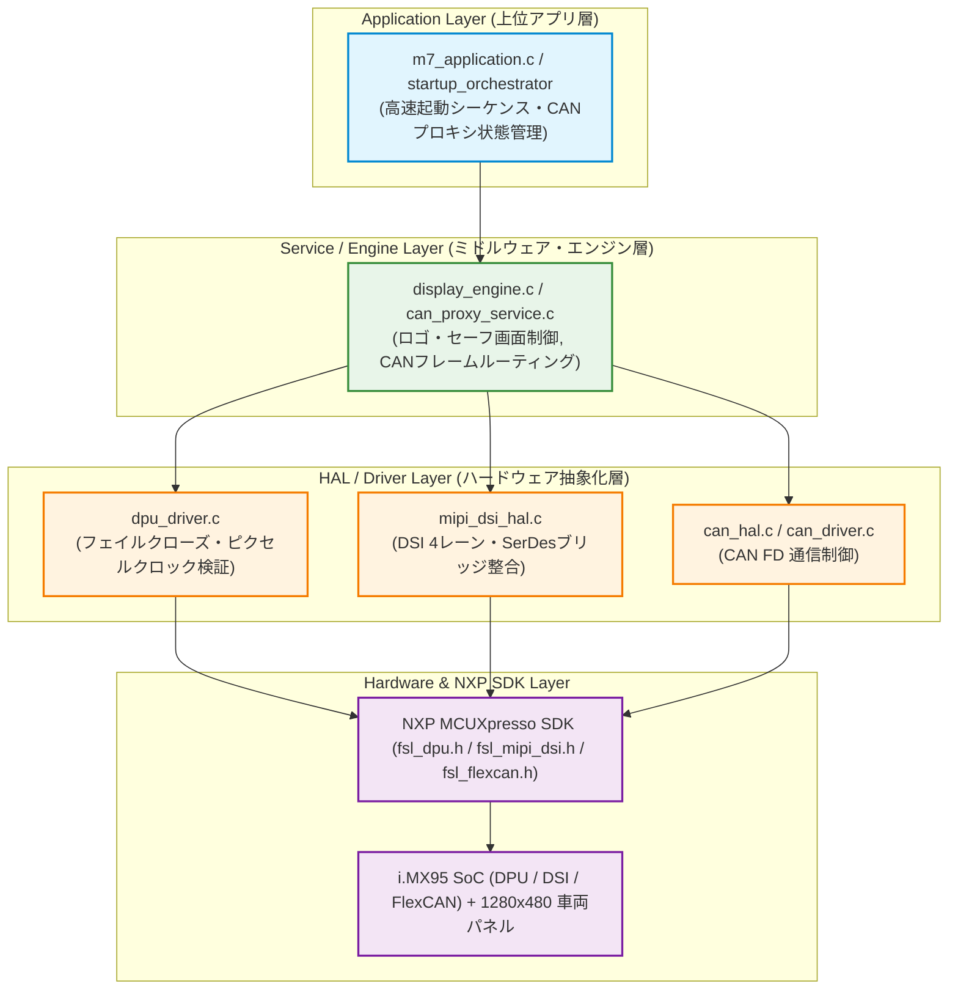
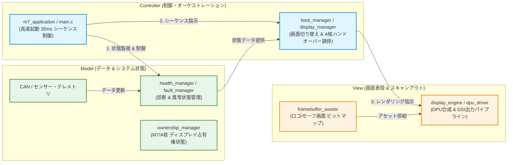
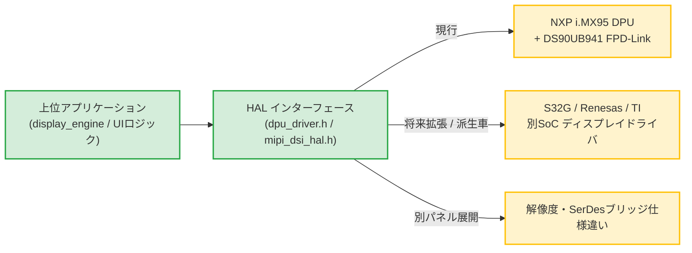
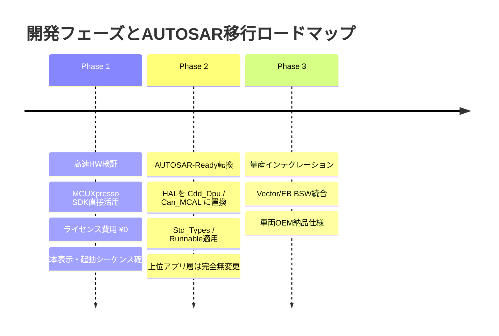

# GCU3 M7 ソフトウェアアーキテクチャ & HAL/MVC設計戦略 報告資料

---

## Slide 1. 表紙 (Title)

# Kubota GCU3 M7 プロジェクト
## ソフトウェアアーキテクチャ概要、MVCパターン適用 & HAL採用戦略

**対象システム:** NXP i.MX95 (Cortex-M7) 超高速起動 車両クラスター / ディスプレイ制御プラットフォーム  
**作成目的:** 現行ソフトウェア構造、MVCパターンによるデータ/表示/制御の分離、および HAL 導入による開発効率・安全性・AUTOSAR移行戦略の報告  
**策定フェーズ:** Phase 1 (NXP SDK直接活用・HW Bring-up) $\rightarrow$ Phase 2 (AUTOSAR-Ready転換)

---

## Slide 2. 現行ソフトウェア構造 (Current Architecture)

### 3層レイヤードアーキテクチャ + Phase 1/Phase 2 段階的展開モデル



> [!NOTE]
> **現行設計のポイント:**  
> 上位のアプリケーション／エンジン層は、ハードウェア固有のレジスタやNXP SDK API（`fsl_*.h`）を一切直接参照せず、**HALの共通インターフェースのみを経由**して制御されます。

---

## Slide 3. MVC (Model-View-Controller) パターン適用設計

### 車両クラスター・ディスプレイ制御におけるMVC分離構造



* **Model (状態・データ):** 画面の描画方法に関知せず、純粋な車両データ、CAN信号、診断・故障状態(`fault_manager`)、画面占有権(`ownership_manager`)を保持。
* **View (表現・出力):** なぜその画面を出すかの判断を持たず、Controllerから指定されたフレームバッファをハードウェア(DPU/DSI)へ最速でスキャンアウト。
* **Controller (調停・制御):** Ignition ON $\rightarrow$ 35msロゴ表示 $\rightarrow$ A核ハンドオーバー $\rightarrow$ 異常時セーフ画面切り替えのライフサイクルと状態遷移を集中統括。

---

## Slide 4. HALの必要性 ①：ビジネスロジックとハードウェアの完全分離 (Decoupling)

### 課題とHALによる解決

* **直面する課題:**
  * ディスプレイエンジンやCAN状態管理のコード内に、SoC固有のレジスタ設定やSDK固有の関数が混在すると、コードの可読性と保守性が著しく低下する。
* **HALによる解決アプローチ:**
  * `display_engine` などの上位層は **「ロゴを表示する」「セーフ画面へ切り替える」** という純粋な制御意図（ユースケース）のみを記述。
  * タイミングレジスタ設定、シャドウロードトリガー（`DPU_TriggerShadowLoad`）、DSIレーン制御などの低レベル制御はすべて HAL 内部にカプセル化。

```
【上位エンジン層】 display_engine_render_logo()  <-- 制御意図のみ
        │ (抽象インターフェース)
        ▼
【HAL層】         dpu_driver_submit_frame("logo") 
                  DPU_SetFetchUnitBaseAddr(...) + DPU_TriggerShadowLoad(...)
```

---

## Slide 5. HALの必要性 ②：チップセット・ハードウェア変更への柔軟な適応 (Portability)

### 将来のSoC・周辺IC変更に対する耐性



* **資産の保護:**
  * クラスター表示ロジック、起動アニメーションシーケンス、フェイルセーフ状態遷移などのコア資産をそのまま再利用可能。
* **開発工数の削減:**
  * 派生車両や新SoCへの展開時、修正対象を **HALのドライバ層（数ファイル）のみに局所化** でき、全体の再テスト工数を大幅に削減。

---

## Slide 6. HALの必要性 ③：実機レス検証・シミュレーション環境の実現 (Virtual Testing & Mocking)

### 実機（HW）完成を待たずにソフトウェア開発・検証を並行稼働

* **課題:**
  * 車両ECUハードウェアの製造遅延やボード台数不足により、ソフトウェア開発が停滞するリスク。
* **HAL導入の効果:**
  * HALインターフェースに対して **Mock（模擬）ドライバ** や **PC向けエミュレータ（Python/Web）** を結合可能。
  * ターゲットボード（i.MX95 EVK）がなくても、PC上で起動シーケンス、画面遷移、エラー処理の単体テスト（Unit Test）を100%自動化可能。

| 検証項目 | 実機直接依存（HALなし） | HAL分離アーキテクチャ（現行） |
| :--- | :--- | :--- |
| **画面遷移・状態検証** | 実機ボード + パネル必須 | **PC上エミュレータで即時検証可能** |
| **CI/CD 自動テスト** | テストベンチ構築が高コスト | **GitHub Actions等で全自動テスト可能** |
| **障害シミュレーション** | 意図的なHW故障注入が困難 | **HAL戻り値のMock化で容易にテスト** |

---

## Slide 7. HALの必要性 ④：量産時 AUTOSAR (MCAL/CDD) 移行コストの最小化 (Smooth AUTOSAR Migration)

### Phase 1（無償SDKでの迅速なHW検証）から Phase 2（AUTOSAR化）への二段階戦略



* **コストとリスクの最適化:**
  * 最初から高額なAUTOSARツール・BSWライセンスを購入せず、無償SDKでHW Bring-upを完了。
* **アーキテクチャの親和性:**
  * HALを介した設計になっているため、Phase 2では **HAL層を AUTOSAR CDD (Complex Device Driver) ラッパーに置き換えるだけ** でスムーズに規格適合を完了。

---

## Slide 8. HALの必要性 ⑤：Fail-Safe & 安全ガードの集約化 (Safety Guard & Fail-Closed)

### 誤設定や未確定パラメータによるハードウェア物理損傷の防止

* **背景（GATE-PCLK-01の事例）:**
  * 7インチ車両用パネルのタイミングデータシートが未確定な状態で誤ったクロックを出力すると、パネル破損や表示同期崩れが発生する危険性。
* **HALによる集中防御:**
  * 上位層がどのような引数を渡しても、**HAL/ドライバの最前線でパラメータをバリデーションし、安全に遮断（Fail-Closed）**。

```c
/* dpu_driver.c (HAL内部での安全ガード集中処理) */
DPU_GetDefaultDisplayTimingConfig(&s_timing);

if (s_cfg.pixel_clock_hz == 0U) {
    /* GATE-PCLK-01 OPEN: 実際のパネルタイミング未確定状態でのDPU出力を厳格に遮断 */
    return -1;
}
```

> [!IMPORTANT]
> 安全要求（ISO 26262機能安全など）に基づくガード処理をHAL層に一元化することで、アプリ開発者の記述漏れによる事故をアーキテクチャ構造として完全に防ぎます。

---

## Slide 9. 全体まとめ (Summary & Next Steps)

### アーキテクチャ総括

1. **MVC分離 & 多層構造:** Model(データ/状態)・View(表示/HAL)・Controller(制御)を完全分離し、35ms超高速起動と柔軟な画面遷移を両立。
2. **コスト・リスク最適化:** Phase 1（SDK直接）でライセンス費用を抑えて迅速に検証し、Phase 2で上位資産を無駄にせず AUTOSAR (CDD) 化する合理的アプローチ。
3. **品質・堅牢性:** Fail-Closed 安全機構（`GATE-PCLK-01`）をHALに組み込み、実機レス検証環境と高信頼性を両立。

### 今後の推進マイルストーン

- [x] **Phase 1 基本設計:** MCUXpresso SDKベースのHAL実装 & DPUフェイルクローズ検証 **(完了)**
- [ ] **実パネル整合:** パネルメーカー正式データシート受領に伴う PCLK / タイミングテーブル確定 (`GATE-PCLK-01` CLOSE)
- [ ] **Phase 2 展開準備:** `dpu_driver.c` $\rightarrow$ `Cdd_Dpu.c` へのインターフェースラッパー設計および AUTOSAR Std_Types 適合化
